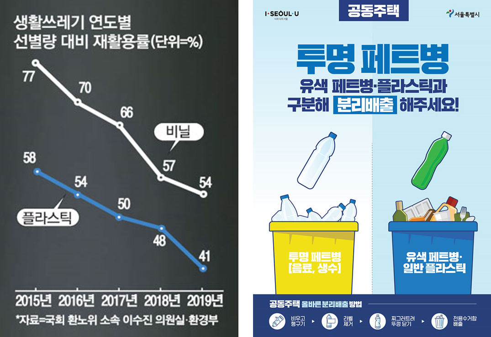
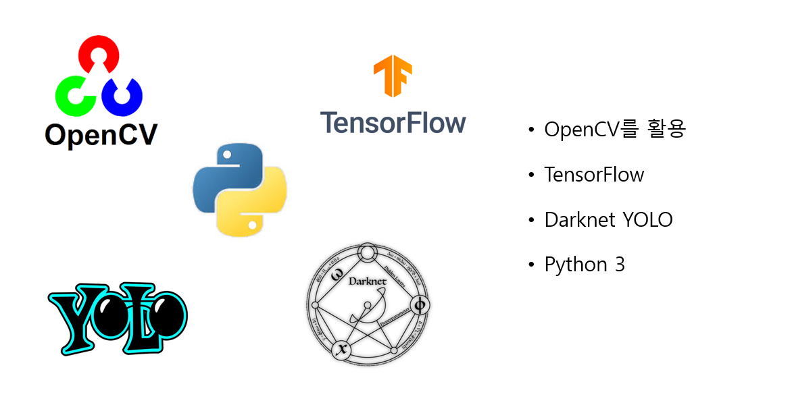

# AI-Cycle
Application of AI Super Resolution and Object Detection for Surveillance Cameras Monitoring Recycling Process

## Overview
<br>
인공지능 초해상화 알고리즘과 이미지 인식을 활용한 재활용 모니터링 CCTV<br>
플라스틱 제품의 재활용률은 선별량 대비 50% 미만의 수치를 보이고 있다. 이에 대한
해결책으로 재활용 전 선별이 중요시되고 있다. 본 프로젝트는 재활용 전 선별 방법으로
2020년 12월 개정된 “재활용가능자원의 분리수거 등에 관한 지침”에 주목하고,
사람들에게 해당 내용에 대해 안내함으로써 분리배출 과정에서의 개선을 제안한다.<br>
사물인식 기술을 활용해 CCTV 영상 속 버려지는 플라스틱 제품의 종류를 파악한다. 서울시 공동주택을 기준으로 개정된 분리배출 지침에
어긋나는 경우를 발견했을 때 사람들에게 올바른 분리배출 방법을 알려주는 것을 목표로
한다.

## Data
**Train**
- [Super Resolution] VOC2012, DIV2K 데이터셋을 활용해 모델을 학습시켰다. 
- [Object Detection] 이미지 크롤링을 통해 데이터셋을 직접 구축하였다. 자세한 내용은 [preprocess](./preprocess/README.md) 에서 확인할 수 있다. 

**Test**
- Video
- Webcam


## Models
- [Super Resolution] **ESPCN** - [Real-Time Single Image and Video Super-Resolution Using Efficient Sub-Pixel Convolutional Neural Network, 2016 (Wenzhe Shi, Jose Caballero, Ferenc Huszar)](https://arxiv.org/pdf/1609.05158.pdf)

- [Object Detection] **YOLOv4** - [Optimal Speed and Accuracy of Object Detection Review, 2020 (Alexey Bochkovskiy, Chien-Yao Wang, Hong-Yuan Mark Liao)](https://arxiv.org/pdf/2004.10934.pdf)

**Technology Stack**<br>


## Result


## Usage


## Contributors
**Super Resolution**<br>
김태희 <!--각자 이름 추가-->

**Object Detection**<br>
정성경 <!--각자 이름 추가-->

## Structure
```

```