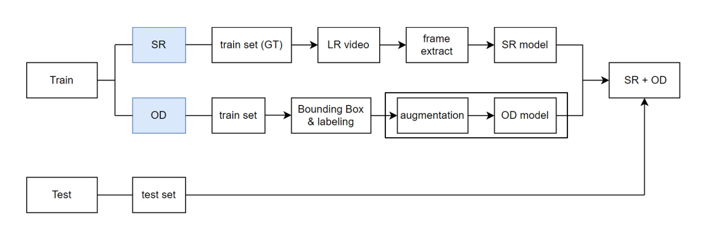

# AI-Cycle
Application of AI Super Resolution and Object Detection for Surveillance Cameras Monitoring Recycling Process<br>
2021.01.18~2021.03.08

## Overview
<br>
인공지능 초해상화 알고리즘과 이미지 인식을 활용한 재활용 모니터링 CCTV<br>

플라스틱 제품의 재활용률은 선별량 대비 50% 미만의 수치를 보이고 있다. 이에 대한
해결책으로 재활용 전 선별이 중요시되고 있다. 본 프로젝트는 재활용 전 선별 방법으로
2020년 12월 개정된 “재활용가능자원의 분리수거 등에 관한 지침”에 주목하고,
사람들에게 해당 내용에 대해 안내함으로써 분리배출 과정에서의 개선을 제안한다.<br>
사물인식 기술을 활용해 CCTV 영상 속 버려지는 플라스틱 제품의 종류를 파악한다. 서울시 공동주택을 기준으로 개정된 분리배출 지침에
어긋나는 경우를 발견했을 때 사람들에게 올바른 분리배출 방법을 알려주는 것을 목표로
한다.

## Data
**Train**
- [Super Resolution] BSDS300, DIV2K 데이터셋을 활용해 모델을 학습하였다. 
- [Object Detection] 이미지 크롤링을 통해 데이터셋을 직접 구축하였다. 자세한 내용은 [preprocess](./preprocess/README.md) 에서 확인할 수 있다. 

**Test**
- Video
- Webcam

## Technology Stack
<br>

## Models
- [Super Resolution] **ESPCN** - [Real-Time Single Image and Video Super-Resolution Using Efficient Sub-Pixel Convolutional Neural Network, 2016 (Wenzhe Shi, Jose Caballero, Ferenc Huszar)](https://arxiv.org/pdf/1609.05158.pdf)

- [Object Detection] **YOLOv4** - [Optimal Speed and Accuracy of Object Detection Review, 2020 (Alexey Bochkovskiy, Chien-Yao Wang, Hong-Yuan Mark Liao)](https://arxiv.org/pdf/2004.10934.pdf)

**Flowchart**<br>


## Result


## Usage
Clone Repository
```
HTTPS:
git clone https://github.com/Taehee-K/AI-Cycle

SSH: 
git clone git@github.com:Taehee-K/AI-Cycle
```
### 구글 코랩(Colab)에서 실행하기(권장)
- Colab에서 [런타임] - [런타임 유형 변경] - 하드웨어 가속기(GPU) 사용을 권장합니다.
- SR + OD >> Video: [](https://colab.research.google.com/github/Taehee-K/AI-Cycle/blob/master/result/sr_od_video.ipynb)
- OD >> Webcam: [](https://github.com/Taehee-K/AI-Cycle/blob/master/result/od_webcam.ipynb)

### 로컬에서 실행하기
-  Go to project root directory -> results
    ```
    cd AI-Cycle/results/
    ```
- Run Models
   - SR + OD >> Video: run [sr_od_video.ipynb](https://github.com/Taehee-K/AI-Cycle/blob/master/result/sr_od_video.ipynb)
   - OD >> Webcam: run [od_webcam.ipynb](https://github.com/Taehee-K/AI-Cycle/blob/master/result/od_webcam.ipynb)

**Note:** Jupyter Notebook 안의 모델 & 파라미터 경로들이 다 상대적이지는 않습니다. 실행 전 주석에 따라 리팩토링이 필요할 수 있습니다. <br>
<!--Make sure to include correct model & parameter paths in the notebooks as not everything is relative right now and it needs some refactoring-->

## Contributors
**Super Resolution**<br>
고은지 김태희<sup>*</sup> 이수연 이지호

**Object Detection**<br>
양원재 정성경<sup>*</sup> 최미소

## References
* [developer0hye/Yolo_Label](https://github.com/developer0hye/Yolo_Label)
* [windmaple/ESPCN](https://github.com/windmaple/ESPCN)
* [quangnhat185/darknet_for_colab](https://github.com/quangnhat185/darknet_for_colab)
* [theAIGuysCode/YOLOv4-Cloud-Tutorial](https://github.com/theAIGuysCode/YOLOv4-Cloud-Tutorial)

## Structure
```
AI-Cycle
├── README.md
├── LICENSE
├── preprocess
│   ├───crawling.py
│   └───README.md
│
├── data
│   ├───classes.names
│   ├───yolov4_custom_test.cfg
│   ├───yolov4_custom_train.cfg
│   └───yolov4_custom_train.weights
│
├── models
│   ├───export_ep700
│   ├───ESPCN(ep_700).ipynb
│   └───//YOLOv4.ipynb
│
├── result
│   ├───od_webcam.ipynb
│   └───sr_od_video.ipynb
│   
```
