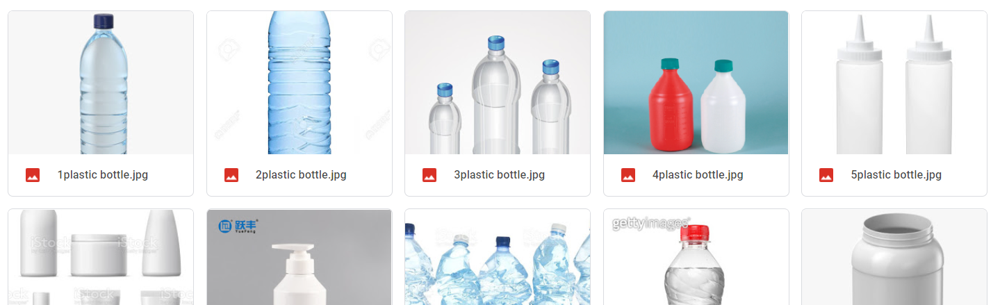

# Preprocess

## Data Collection

Selenium 라이브러리를 이용하여 Google Photo에서 총 7가지 키워드로 Web Crawling.  
2974장을 수집 후,
Data Cleansing를 거쳐 총 1335장의 사진 확보.
* Keywords : plastic bottle, coloerd plastic bottle, labeled plastic bottle, plastic bottles, 플라스틱 병, 투명 플라스틱, 음료수

## Labeling & Bounding Box
라벨링 tool 중 [Yolo Label](https://github.com/developer0hye/Yolo_Label)을 이용하여 Labeling과 Bounding Box 진행. 
이미지에 Labeling Bounding Box를 그려 각 이미지의 Labeling text 생성. (복수 라벨링 가능)
* Labeling text format : label, central x-coordinate, central y-coordinate, width, height
* Label
    | Clean | Labeled | Colored |
    |:-----:|:-------:|:-------:|
    | .png) | .png) | .png) |
